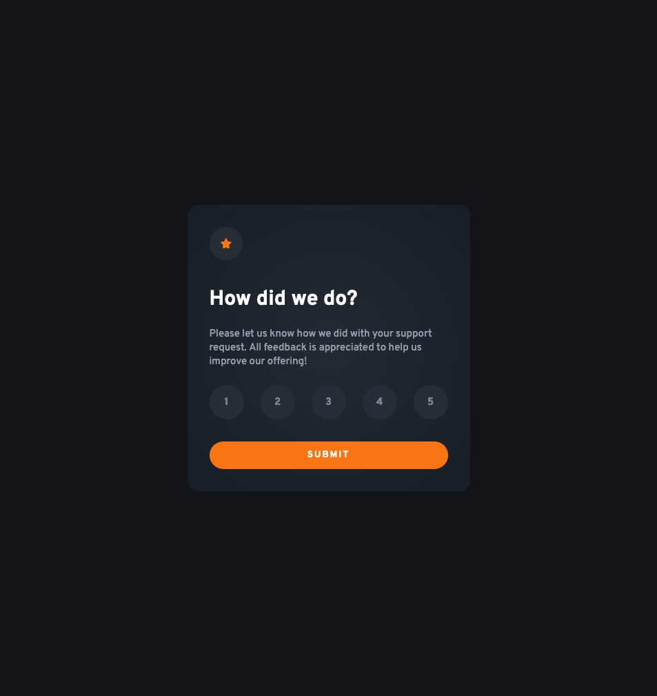
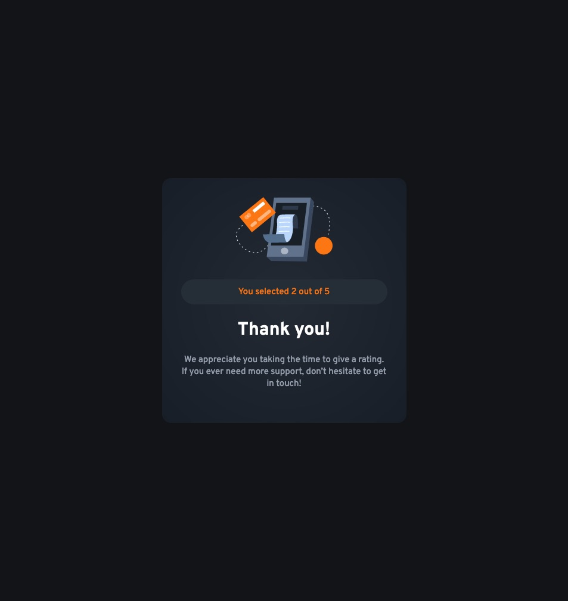

# Frontend Mentor - Interactive rating component solution

This is a solution to the [Interactive rating component challenge on Frontend Mentor](https://www.frontendmentor.io/challenges/interactive-rating-component-koxpeBUmI). Frontend Mentor challenges help you improve your coding skills by building realistic projects.

## Table of contents

- [Overview](#overview)
  - [The challenge](#the-challenge)
  - [Screenshot](#screenshot)
  - [Links](#links)
- [My process](#my-process)
  - [Built with](#built-with)
  - [What I learned](#what-i-learned)
  - [Useful resources](#useful-resources)
- [Author](#author)

## Overview

### The challenge

Users should be able to:

- View the optimal layout for the app depending on their device's screen size
- See hover states for all interactive elements on the page
- Select and submit a number rating
- See the "Thank you" card state after submitting a rating

### Screenshot




### Links

- Solution URL: [Github](https://github.com/graficdoctor/fe-23-interactive-rating-component-main)
- Live Site URL: [Add live site URL here](https://your-live-site-url.com)

## My process

### Built with

- Semantic HTML5 markup
- CSS custom properties
- Flexbox
- CSS Grid
- Mobile-first workflow

### What I learned

The rating-buttons got squeezed on small screenwidths. To solve this, I added a media-query which would add a gap to the buttons instead of using the `justify-content`.

```css
@media (max-width: 325px) {
  .rating-buttons {
    justify-content: unset;
    gap: 1rem;
  }
}
```

I mainly learned how to find list items that have been clicked. Plus how to select elements by `tagName` in Javascript. I used the links below to help me find my solution.

### Useful resources

- [How to get Value / Text of a List item Javascript](https://stackoverflow.com/questions/18185963/how-to-get-value-text-of-a-list-item-javascript) - How to get the value of a list-item?
- [Detect click with pure JavaScript](https://clubmate.fi/detect-click-with-pure-javascript) - How to determine which element in a list has been clicked?

## Author

- Frontend Mentor - [@graficdoctor](https://www.frontendmentor.io/profile/graficdoctor)
- Twitter - [@graficdoctor](https://www.twitter.com/graficdoctor)
